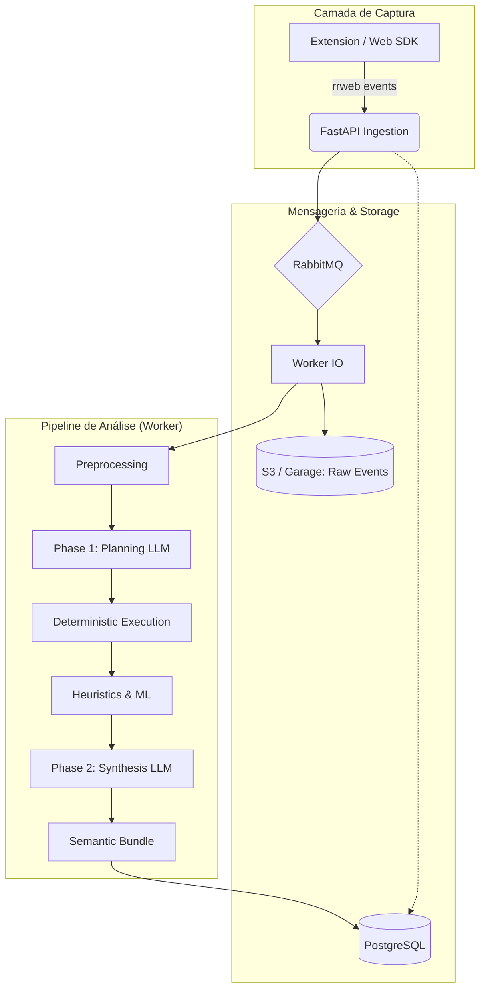

# UX Auditor API

[](https://www.python.org/)
[](https://fastapi.tiangolo.com/)
[](LICENSE)

A **UX Auditor API** é uma plataforma avançada de backend para análise quantitativa e qualitativa da experiência do usuário (UX). Ela transforma fluxos de eventos brutos de telemetria (`rrweb`) em insights acionáveis, combinando heurísticas determinísticas, Machine Learning e Interpretação Semântica via LLM.

## 🚀 Visão Geral

O sistema automatiza a auditoria de interfaces ao identificar frustrações, anomalias comportamentais e intenções do usuário sem a necessidade de revisão manual de vídeos de sessão.

### Principais Capacidades
- **Detecção de Frustrações:** Identificação automática de *Rage Clicks*, *Dead Clicks* e *Excessive Scrolling*.
- **Análise Cinemática (ML):** Detecção de movimentos erráticos de mouse usando *Isolation Forest*.
- **Pipeline Semântico de Duas Fases:**
  - **Fase 1 (Planning):** O LLM mapeia a estrutura da página e define um plano de extração.
  - **Fase 2 (Synthesis):** O LLM interpreta um "Bundle Semântico" compactado para gerar narrativas e psicometria.
- **Arquitetura Assíncrona:** Ingestão de alta performance com processamento em background via RabbitMQ e Workers dedicados.

## 🏗️ Arquitetura do Sistema



## 🛠️ Fluxo de Dados

1.  **Ingestão:** Os eventos `rrweb` são recebidos via `/ingest`, validados e enfileirados no RabbitMQ.
2.  **Persistência Bruta:** O Worker salva o JSON original no storage S3 (Garage) para fins de auditoria e reprocessamento.
3.  **Processamento Semântico:**
    - **Normalização:** Conversão de eventos técnicos em vetores cinemáticos e ações DOM.
    - **Extração de Landmarks:** Identificação de elementos críticos (botões, inputs, modais).
    - **Interpretação:** O LLM não "lê" o rrweb bruto; ele analisa um resumo executivo das interações para máxima eficiência e precisão.

## 🚦 Começando

### Pré-requisitos
- Docker e Docker Compose
- Python 3.10+ (para desenvolvimento local)
- Chave de API da OpenAI (para análise semântica)

### Instalação via Docker
```bash
# Clone o repositório
git clone https://github.com/seu-usuario/ux-auditor-api.git
cd ux-auditor-api

# Configure as variáveis de ambiente
cp .env.example .env

# Suba os serviços
docker-compose up -d
```

### Endpoints Principais
- `POST /ingest`: Ponto de entrada para novos eventos de sessão.
- `GET /sessions/{uuid}/status`: Consulta o progresso do processamento.
- `GET /sessions/{uuid}/analysis`: Recupera o resultado consolidado da análise UX.

## 📖 Documentação Detalhada

Para informações técnicas aprofundadas, consulte a pasta `/docs`:

- [**Arquitetura e Pipeline**](docs/overview.md): Detalhes sobre o fluxo de processamento e agentes.
- [**Análise Heurística**](docs/heuristic_analysis.md): Catálogo de padrões detectados.
- [**Modelos de ML**](docs/ml_anomalies_analysis.md): Detalhes sobre a detecção de anomalias cinemáticas.
- [**Infraestrutura de Auth**](docs/auth_infrastructure.md): Integração com Janus IDP e OAuth2.

---
Desenvolvido como parte do projeto de mestrado em UX Auditing.
