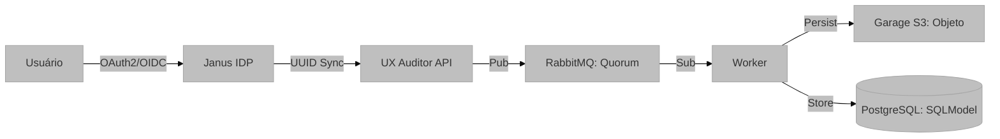

# Infraestrutura: Autenticação, Persistência e Mensageria

## Visão Geral e Propósito
Este módulo documenta a espinha dorsal da **UX Auditor API**, responsável pela orquestração de serviços, segurança e persistência de dados. O sistema foi projetado para ser resiliente e escalável, integrando-se a um ecossistema de microserviços.

## Arquitetura e Lógica

A infraestrutura baseia-se em quatro pilares:

1.  **Autenticação Unificada (Janus IDP):** O sistema não gerencia senhas localmente. Ele atua como um provedor de recursos (Resource Server) em um fluxo OAuth2. O registro de usuários é sincronizado via API `X-Service-Key` para garantir paridade de UUIDs entre o Identity Provider (Janus) e o UX Auditor.
2.  **Mensageria Assíncrona (RabbitMQ):** Ingestão de telemetria é desacoplada do processamento. O endpoint `/ingest` apenas publica na fila, garantindo baixa latência para o cliente de captura.
3.  **Storage Distribuído (Garage S3):** Eventos brutos volumosos são armazenados em um objeto S3, mantendo o banco de dados relacional limpo e performático.
4.  **Persistência Relacional (SQLModel/PostgreSQL):** Utiliza SQLModel (baseado em SQLAlchemy e Pydantic) para garantir que os modelos de dados da API sejam idênticos aos esquemas do banco.

## Fundamentação Matemática
A integridade dos dados é garantida via hashing e validação de tokens JWT.
*   **Assinatura de Token:** 
    $$ 	ext{Signature} = 	ext{HMAC-SHA256}(	ext{header} + "." + 	ext{payload}, 	ext{secret}) $$
*   **Idempotência de Registro:** O fluxo de registro utiliza o UUID retornado pelo Janus como chave primária, garantindo consistência referencial ($FK = PK$).

## Parâmetros Técnicos
*   `RABBITMQ_QUEUE_TYPE`: Quorum (Garante alta disponibilidade e consistência).
*   `JWT_ALGORITHM`: RS256 ou HS256 (conforme configurado no IDP).
*   `SQLMODEL_POOL_SIZE`: Configurado para suportar concorrência de workers.

## Mapeamento Tecnológico e Referências
*   **FastAPI & SQLModel:** [Referência SQLModel](https://sqlmodel.tiangolo.com/)
*   **RabbitMQ:** Broker de mensagens AMQP. [Documentação](https://www.rabbitmq.com/documentation.html)
*   **Garage:** S3-compatible object storage. [Link](https://garagehq.cula.jp/)
*   **OAuth 2.0 / OIDC:** Protocolos padrão de autorização. [RFC 6749](https://datatools.ietf.org/html/rfc6749)

## Justificativa de Escolha
A escolha pelo **RabbitMQ com Quorum Queues** justifica-se pela necessidade de durabilidade dos dados de telemetria (não podemos perder sessões de usuário). A integração com o **Janus IDP** permite que a ferramenta de auditoria seja facilmente integrada em ecossistemas empresariais já existentes que utilizam Single Sign-On (SSO).
