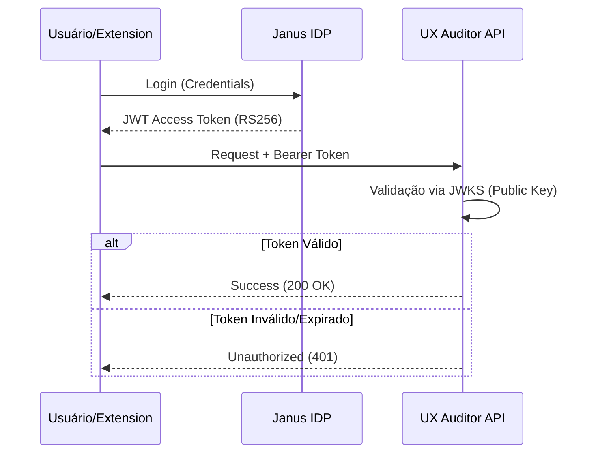

# Infraestrutura de Autenticação e Segurança

Este documento detalha a implementação do **Resource Server OAuth2** e a integração com o provedor de identidade **Janus IDP**.

## 1. Modelo de Segurança

A UX Auditor API atua como um Resource Server que não armazena credenciais. Toda a autenticação é delegada ao Janus IDP via tokens **JWT RS256**.

### Fluxo de Autenticação



## 2. Validação Dinâmica (JWKS)

Em vez de armazenar a chave pública localmente, a API utiliza o endpoint **JWKS (JSON Web Key Set)** do Janus para obter as chaves de validação dinamicamente.

- **Endpoint:** `${AUTH_ISSUER_URL}/protocol/openid-connect/certs`
- **Algoritmo:** RS256 (Criptografia Assimétrica)
- **Cache:** As chaves são cacheadas por 5 minutos para otimizar a performance e reduzir latência.

## 3. Configuração de Variáveis de Ambiente

As seguintes variáveis no `.env` controlam a segurança:

```env
# URL do emissor (Realm do Janus)
AUTH_ISSUER_URL=https://janus.exemplo.com/realms/master

# Audience esperada (opcional, para maior segurança)
AUTH_AUDIENCE=ux-auditor-api

# Algoritmo de assinatura
JWT_ALGORITHM=RS256
```

## 4. Claims Validados

A API valida rigorosamente os seguintes campos no payload do JWT:
- `iss` (Issuer): Deve corresponder exatamente à URL configurada.
- `exp` (Expiration): O token deve estar dentro do prazo de validade.
- `sub` (Subject): Identificador único do usuário, usado para vincular sessões no banco de dados.
- `aud` (Audience): Se configurado, deve corresponder ao ID da API.

## 5. Integração com Banco de Dados

Ao receber um novo `user_id` (`sub`) via token, o sistema garante a existência do registro na tabela `User` via fluxo de "Just-in-Time Provisioning". Isso garante que toda análise de sessão esteja vinculada a uma identidade válida sem necessidade de um fluxo de registro separado na API.

## 6. Segurança em Produção

1.  **TLS/SSL:** Todos os endpoints devem ser servidos via HTTPS.
2.  **Scopes:** A API pode ser configurada para validar escopos específicos (ex: `ux:write`, `ux:read`).
3.  **Rate Limiting:** Recomendado implementar no nível de Ingress/Proxy para evitar abusos no endpoint `/ingest`.
