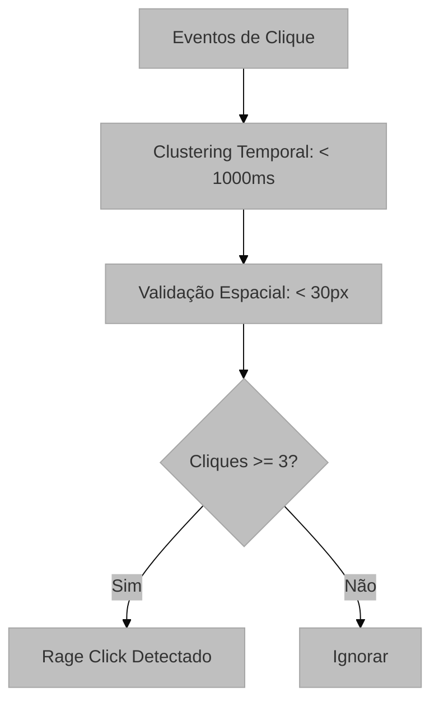

# Detecção Heurística de Frustração (Rage Clicks)

## Visão Geral e Propósito
O módulo `heuristic_analyzer.py` (em `services/heuristic_analyzer.py`) foca na detecção determinística de sinais clássicos de frustração na interface. O principal foco é o **Rage Click**, um comportamento onde o usuário clica repetidamente e de forma rápida em um elemento, geralmente porque o sistema não está respondendo como esperado.

## Arquitetura e Lógica

Diferente do ML, este módulo utiliza um algoritmo baseado em regras (Rule-Based) com janelas deslizantes:

1.  **Filtragem de Interação:** Seleciona apenas eventos do tipo `mouse-interaction` de clique.
2.  **Clustering Temporal:** Agrupa cliques que ocorrem em uma janela de tempo curta.
3.  **Validação Espacial:** Verifica se esses cliques ocorreram na mesma vizinhança geométrica.
4.  **Emissão de Alerta:** Se o número de cliques no cluster exceder o limiar, um evento crítico é gerado.

## Fundamentação Matemática
O algoritmo utiliza uma métrica de proximidade espacial e densidade temporal.

*   **Janela Temporal ($\Delta T$):** Define o limite de tempo para agrupar $N$ cliques consecutivos.
    $$ t_n - t_1 \leq 1000	ext{ms} $$
*   **Proximidade Espacial ($D$):** Todos os cliques dentro do cluster devem estar dentro de um raio de 30 pixels do ponto inicial.
    $$ \forall P_j \in 	ext{Cluster}, \sqrt{(x_j-x_i)^2 + (y_j-y_i)^2} \leq 30	ext{px} $$

## Parâmetros Técnicos
*   `min_clicks=3`: Número mínimo de cliques para caracterizar "Rage".
*   `time_threshold=1000ms`: Janela de tempo máxima.
*   `distance_threshold=30px`: Raio espacial máximo.

## Mapeamento Tecnológico e Referências
*   **Conceito:** Rage Click Analysis. Frequentemente citado em ferramentas de *Digital Experience Intelligence* (DXI) como Hotjar e FullStory.
*   **Referência Acadêmica:** Akram, A., et al. (2019). "Characterizing User Frustration via Mouse Cursor Movements." *In Proceedings of the 2019 CHI Conference on Human Factors in Computing Systems*.

## Justificativa de Escolha
O uso de heurísticas determinísticas para Rage Clicks é preferível ao ML por sua transparência e baixa taxa de falsos positivos. Como é um comportamento bem definido e de alto impacto para a UX, uma regra clara permite que desenvolvedores identifiquem imediatamente bugs de UI ou problemas de latência.
