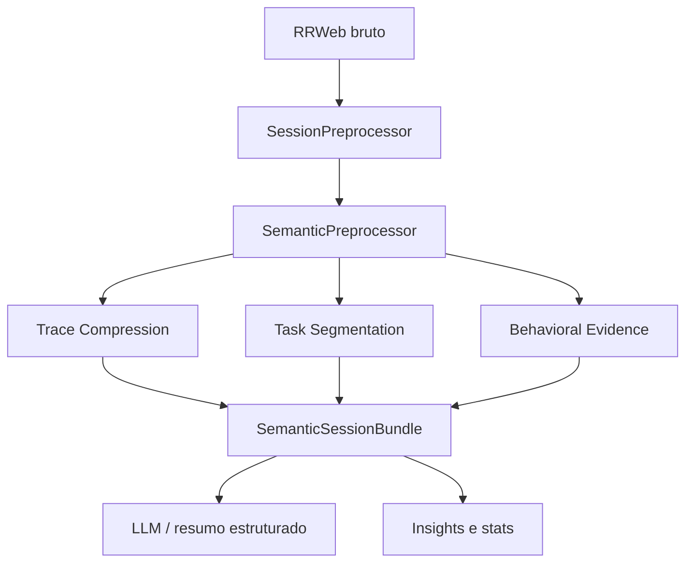

# Análise Heurística da Sessão

## Visão Geral

O sistema heurístico atual funciona como um conjunto modular de funções puras, registradas em `services/heuristics/`, que operam sobre um contexto padronizado e produzem sinais rastreáveis para três finalidades diferentes:

1. segmentar a sessão em blocos coerentes de trabalho;
2. comprimir redundâncias para reduzir ruído estrutural;
3. identificar evidências comportamentais que alimentam a narrativa da análise.

Na prática, isso significa que o pipeline deixou de ser uma regra única de frustração e passou a representar o fluxo inteiro de interação do usuário: pausas, revisitas, alternância, revisão de valores, navegação, busca visual e fricção de clique.

## Onde Isso Entra No Pipeline

O fluxo real fica assim:

1. `services/session_job_processor.py` normaliza os eventos rrweb e aciona o pré-processamento técnico.
2. `services/semantic_preprocessor.py` transforma os eventos em ações semânticas e sinais cinemáticos.
3. `services/trace_compressor.py` aplica heurísticas de compactação para colapsar redundâncias.
4. `services/task_segmenter.py` aplica heurísticas de segmentação para dividir a sessão em blocos de tarefa.
5. `services/evidence_detector.py` executa as heurísticas de evidência comportamental.
6. `services/session_summarizer.py` junta tudo no `SemanticSessionBundle`, que depois alimenta o motor generativo e os relatórios estruturados.

## Contrato Das Heurísticas

Todas as heurísticas do pacote seguem o mesmo contrato:

- recebem um `HeuristicContext`;
- não fazem IO, logging nem persistência;
- retornam uma lista de `HeuristicMatch`;
- cada match traz nome, categoria, confiança, intervalo temporal, alvo principal e um bloco de evidências.

Os tipos centrais estão em:

- [`services/heuristics/types.py`](../services/heuristics/types.py)
- [`services/heuristics/base.py`](../services/heuristics/base.py)
- [`services/heuristics/registry.py`](../services/heuristics/registry.py)

O contexto padronizado carrega:

- `actions`: ações semânticas ordenadas;
- `kinematics`: vetores de movimento do cursor;
- `dom_map`: mapa DOM normalizado;
- `page_context`: metadados da página e da segmentação;
- `config`: thresholds e parâmetros do `settings`.

## Registros Atuais

O registry atual separa as heurísticas em três famílias:

- `SEGMENTATION_HEURISTICS`
- `COMPRESSION_HEURISTICS`
- `EVIDENCE_HEURISTICS`

Essa separação não é cosmética. Ela define em que etapa o sinal é consumido e como ele será usado depois.

### 1. Segmentação

Implementada em `services/task_segmenter.py` e registrada em `SEGMENTATION_HEURISTICS`.

Heurísticas atuais:

- `long_idle`
- `page_change`
- `area_shift`

O papel dessa camada é cortar a sessão em blocos coerentes de atividade. Ela olha para gaps temporais, mudança de página e mudança de área funcional para marcar que o usuário provavelmente encerrou uma tarefa e iniciou outra.

Isso produz `TaskSegment` com:

- início e fim;
- área dominante;
- padrão dominante;
- razão da quebra;
- contagem de ações.

### 2. Compressão

Implementada em `services/trace_compressor.py` e registrada em `COMPRESSION_HEURISTICS`.

Heurísticas atuais:

- `sequential_form_filling`
- `repeated_activation`
- `scroll_continuous`
- `selection_oscillation`
- `visual_search_burst`

Essa camada não tenta rotular fricção. O objetivo é reduzir redundância e destacar momentos relevantes sem perder contexto. Por isso ela colapsa sequências repetitivas em blocos menores e gera `candidate_meaningful_moments`.

Exemplos do que ela captura:

- preenchimento sequencial de formulários;
- cliques repetidos no mesmo alvo;
- scroll contínuo na mesma direção;
- oscilação em seletores e toggles;
- rajadas de movimento do mouse associadas à busca visual.

### 3. Evidência Comportamental

Implementada em `services/evidence_detector.py` e registrada em `EVIDENCE_HEURISTICS`.

Heurísticas atuais:

- `long_hesitation`
- `micro_hesitation_pattern`
- `element_revisit`
- `group_revisit`
- `rapid_alternation`
- `input_revision`
- `repeated_toggle`
- `dead_click`
- `rage_click`
- `hover_prolonged`
- `visual_search_burst`
- `erratic_motion`
- `backtracking`
- `sequential_form_filling`
- `out_of_order_filling`

Essa camada é a que mais se aproxima de leitura comportamental. Ela junta pausas, revisitas, alternância rápida, revisão de valores, fricção de clique, busca visual e retrocesso de navegação para estimar onde a experiência do usuário ficou mais custosa ou ambígua.

O resultado é um `BehavioralEvidenceResult` com:

- `heuristic_events`
- `behavioral_signals`
- `candidate_meaningful_moments`

O detector ainda faz uma seleção adicional: parte dos eventos entra como momento candidato por confiança ou por regra de prioridade. Isso ajuda o restante do pipeline a distinguir sinal relevante de mero ruído operacional.

## O Que Cada Grupo Significa

### Fricção De Clique

Heurísticas:

- `rage_click`
- `dead_click`
- `repeated_toggle`
- `repeated_activation`

Interpretação:

- clique repetido rápido no mesmo alvo;
- clique que não produziu resposta aparente;
- alternância insistente em controles de estado.

Esses sinais costumam apontar para botão não responsivo, feedback ausente, latência ou microproblemas de interface.

### Hesitação E Indecisão

Heurísticas:

- `long_hesitation`
- `micro_hesitation_pattern`
- `input_revision`

Interpretação:

- pausas longas entre ações;
- sequências de pausas menores, mas repetidas;
- correção de um valor logo após a primeira entrada.

Esses sinais ajudam a localizar dificuldade de decisão, incerteza ou necessidade de reler a interface antes de agir.

### Revisitas E Alternância

Heurísticas:

- `element_revisit`
- `group_revisit`
- `rapid_alternation`
- `backtracking`

Interpretação:

- retorno ao mesmo elemento;
- retorno a um mesmo grupo funcional;
- troca rápida entre dois alvos;
- volta a uma página ou etapa anterior.

Esses padrões costumam aparecer quando o usuário está comparando opções, tentando recuperar contexto ou corrigindo um caminho errado.

### Busca Visual E Movimento

Heurísticas:

- `hover_prolonged`
- `visual_search_burst`
- `erratic_motion`

Interpretação:

- cursor parado por tempo relevante sobre uma área;
- muitos movimentos do mouse sem ação conclusiva;
- trajetória irregular com muitas mudanças de direção.

Esses sinais costumam indicar leitura exploratória, busca visual, procura por controle ou navegação com incerteza.

### Formulários E Sequências

Heurísticas:

- `sequential_form_filling`
- `out_of_order_filling`

Interpretação:

- preenchimento de campos em sequência natural;
- preenchimento fora da ordem esperada, frequentemente associado a ida e volta cognitiva.

Aqui a heurística é mais estrutural do que emocional. O objetivo é entender como o usuário percorreu o formulário e onde a ordem da interação fugiu do fluxo esperado.

## Base Acadêmica

Nem todas as heurísticas possuem um equivalente acadêmico direto. Algumas são derivações de engenharia sobre sinais observáveis. Ainda assim, vários grupos do sistema se apoiam em conceitos bem estabelecidos em HCI, cognitive load e análise de comportamento.

### 1. Frustração E Sinais De Cursor

Base conceitual:

- movimentos de cursor, velocidade e trajetória podem refletir estados emocionais negativos e aumento de esforço mental;
- cliques repetidos, pausas extensas e trajetórias erráticas são sinais operacionais de fricção, não diagnósticos psicológicos.

Heurísticas relacionadas:

- `rage_click`
- `dead_click`
- `long_hesitation`
- `micro_hesitation_pattern`
- `erratic_motion`
- `hover_prolonged`

Referências usadas:

- Hibbeln, M., et al. "How Is Your User Feeling? Inferring Emotion Through Human-Computer Interaction Devices" (MIS Quarterly, 2017). A base aqui é a ideia de que o cursor pode servir como indicador em tempo real de emoção negativa.

### 2. Busca Visual E Atenção

Base conceitual:

- movimentos de cursor podem acompanhar busca visual e exploração de interface;
- trajetórias longas, densas ou pouco eficientes costumam aparecer quando o usuário está inspecionando a tela em vez de executar uma ação direta.

Heurísticas relacionadas:

- `visual_search_burst`
- `hover_prolonged`
- `erratic_motion`

Referências usadas:

- Raghunath, V., et al. "Mouse cursor movement and eye tracking data as an indicator of pathologists' attention when viewing digital whole slide images" (2012). O trabalho mostra que cursor e atenção podem se correlacionar em tarefas visuais.
- Wilder, J. D., et al. "Attention during active visual tasks: counting, pointing, or simply looking" (Vision Research, 2009). Sustenta a leitura de que o cursor pode acompanhar a distribuição de atenção em tarefas visuais ativas.

### 3. Navegação, Revisitação E Retrocesso

Base conceitual:

- usuários frequentemente alternam entre páginas, passos e áreas quando estão desorientados ou comparando opções;
- backtracking e loops de navegação são sinais clássicos de desorientação e de estratégia exploratória.

Heurísticas relacionadas:

- `element_revisit`
- `group_revisit`
- `rapid_alternation`
- `backtracking`

Referências usadas:

- Javadi, A.-H., et al. "Backtracking during navigation is correlated with enhanced anterior cingulate activity and suppression of alpha oscillations and the 'default-mode' network" (2019). Apoia a interpretação de backtracking como um comportamento de navegação relevante e custoso.
- Münzer, S., Lörch, L., e Frankenstein, J. "Wayfinding and acquisition of spatial knowledge with navigation assistance" (2020). Ajuda a enquadrar o custo cognitivo de navegar, voltar e reorientar-se.

### 4. Fricção Em Formulários

Base conceitual:

- preencher formulários envolve carga cognitiva, memória de trabalho e verificação de consistência;
- revisão de valores e preenchimento fora de ordem podem sinalizar dificuldade, incerteza ou necessidade de reavaliar a tarefa.

Heurísticas relacionadas:

- `sequential_form_filling`
- `out_of_order_filling`
- `input_revision`
- `repeated_toggle`

Referências usadas:

- Haji, F. A., et al. "Measuring cognitive load: performance, mental effort and simulation task complexity" (2015). A literatura de cognitive load ajuda a justificar pausas, revisão e sequenciamento como sinais de esforço.
- aqui a implementação é principalmente operacional: as regras foram desenhadas para refletir padrões observáveis com baixa ambiguidade, e não para medir carga cognitiva de forma clínica.

## O Que O Bundle Final Entrega

Depois de passar por compressão, segmentação e evidência, o bundle final leva para as etapas seguintes:

- `heuristic_events`
- `behavioral_signals`
- `candidate_meaningful_moments`
- `task_segments`
- `dominant_patterns`
- `derived_signals`

Na prática, isso substitui a antiga ideia de "detectar rage clicks" por uma leitura mais ampla da sessão. `rage_click` continua importante, mas agora é apenas um dos sinais dentro de um sistema maior de interpretação.

## Leitura Dos Arquivos Principais

- [`services/heuristics/registry.py`](../services/heuristics/registry.py)
- [`services/evidence_detector.py`](../services/evidence_detector.py)
- [`services/task_segmenter.py`](../services/task_segmenter.py)
- [`services/trace_compressor.py`](../services/trace_compressor.py)
- [`services/session_summarizer.py`](../services/session_summarizer.py)

## Referências Acadêmicas E Teóricas

- [`How Is Your User Feeling? Inferring Emotion Through Human-Computer Interaction Devices`](https://doi.org/10.25300/MISQ/2017/41.1.01)
- [`Mouse cursor movement and eye tracking data as an indicator of pathologists' attention when viewing digital whole slide images`](https://pubmed.ncbi.nlm.nih.gov/23372984/)
- [`Attention during active visual tasks: counting, pointing, or simply looking`](https://pubmed.ncbi.nlm.nih.gov/18649913/)
- [`Backtracking during navigation is correlated with enhanced anterior cingulate activity and suppression of alpha oscillations and the 'default-mode' network`](https://pubmed.ncbi.nlm.nih.gov/31362634/)
- [`Wayfinding and acquisition of spatial knowledge with navigation assistance`](https://pubmed.ncbi.nlm.nih.gov/31246054/)
- [`Measuring cognitive load: performance, mental effort and simulation task complexity`](https://pubmed.ncbi.nlm.nih.gov/26152493/)

Essas referências não validam automaticamente cada threshold da implementação. Elas funcionam como base conceitual para interpretar o tipo de comportamento que as heurísticas procuram capturar.

As referências acima são o suporte conceitual do sistema. A implementação, no entanto, continua determinística e auditável: cada heurística faz uma pergunta simples sobre o rastro do usuário e devolve um match explicável.
