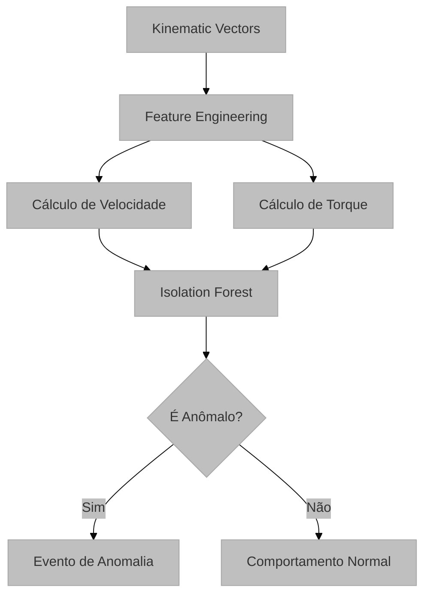

# Detecção de Anomalias Cinemáticas via Heurística Baseada em ML

## Visão Geral e Propósito
O módulo `ml_analyzer.py` (em `services/ml_analyzer.py`) utiliza aprendizado de máquina não supervisionado `IsolationForest` para identificar comportamentos de mouse atípicos ou erráticos. Ao contrário de regras fixas, o ML aprende o padrão de movimento do usuário dentro de uma sessão específica (Self-Baseline) e sinaliza desvios estatísticos significativos.

Ele é executado dentro do pacote de heurísticas em `services/heuristics/evidence/motion.py`. Assim, o ML vira uma heurística do pipeline.

## Arquitetura e Lógica

O pipeline de análise segue três etapas principais:

1.  **Feature Engineering:** O sistema extrai métricas dinâmicas a partir de vetores cinemáticos $\{t, x, y\}$.
    *   **Velocidade ($v$):** Taxa de variação da posição no tempo.
    *   **Variação Angular (Torque $\Delta 	heta$):** Mudança de direção entre vetores consecutivos.
2.  **Modelagem (Isolation Forest):** O algoritmo treina um baseline na própria sessão e identifica outliers no espaço cinemático.
3.  **Filtragem de Insights:** Os pontos identificados como outliers são convertidos em eventos de UX com gravidade média.

## Fundamentação Matemática
A base matemática reside na distância euclidiana para velocidade e na função arcotangente para direção.

*   **Distância Euclidiana:** 
    $$ d(P_1, P_2) = \sqrt{(x_2-x_1)^2 + (y_2-y_1)^2} $$
*   **Velocidade Instantânea:** 
    $$ v_i = \frac{d(P_{i-1}, P_i)}{t_i - t_{i-1}} $$
*   **Ângulo de Movimento ($	heta$):**
    $$ 	heta_i = \operatorname{atan2}(y_i - y_{i-1}, x_i - x_{i-1}) $$
*   **Variação Angular (Torque):**
    $$ \Delta 	heta_i = (	heta_i - 	heta_{i-1} + \pi) \pmod{2\pi} - \pi $$

## Parâmetros Técnicos
*   `contamination=0.05`: Fração esperada de anomalias (5% dos movimentos).
*   `random_state=42`: Semente de aleatoriedade para reprodutibilidade.
*   `min_points=10`: Número mínimo de pontos necessários para realizar a análise.

## Mapeamento Tecnológico e Referências
*   **Abordagem:** Heurística baseada em ML não supervisionado.
*   **Implementação:** `services/ml_analyzer.py` e `services/heuristics/evidence/motion.py`
*   **Algoritmo:** Isolation Forest.
    *   *Artigo Seminal:* Liu, F. T., Ting, K. M., & Zhou, Z. H. (2008). "Isolation forest." *In 2008 Eighth IEEE International Conference on Data Mining*. [Link](https://cs.nju.edu.cn/zhouzh/zhouzh.files/publication/icdm08b.pdf)
*   **Biblioteca:** Scikit-Learn. [Documentação](https://scikit-learn.org/stable/modules/generated/sklearn.ensemble.IsolationForest.html)

## Justificativa de Escolha
A escolha do **Isolation Forest** justifica-se por sua eficiência em detectar anomalias em conjuntos de dados multivariados sem a necessidade de dados rotulados (não supervisionado). Ele é particularmente robusto para capturar movimentos "espasmódicos" ou erráticos que podem indicar frustração do usuário ou dificuldades motoras.
O ML é mantido como heurística porque ele produz sinais auditáveis e funciona sem rótulos. Integrá-lo ao registry de heurísticas deixa o pipeline mais consistente sem perder o comportamento estatístico do detector.
