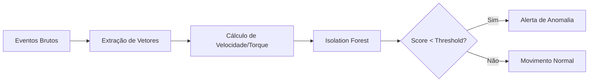

# Análise de Anomalias via Machine Learning

O sistema utiliza Aprendizado Não Supervisionado para detectar comportamentos que fogem ao padrão esperado de interação humana, focando especialmente na cinemática do cursor.

## 1. Algoritmo: Isolation Forest

Diferente de métodos baseados em densidade ou distância, o **Isolation Forest** isola anomalias selecionando aleatoriamente uma característica e um valor de divisão. Como anomalias são raras e diferentes, elas tendem a ser isoladas em partições muito mais rasas da árvore.

### Por que Isolation Forest?
- **Eficiência:** O(n log n), ideal para processar milhares de pontos cinemáticos por sessão.
- **Robustez:** Lida bem com dados de alta dimensionalidade sem necessidade de normalização complexa.
- **Independência de Domínio:** Não precisa de dados rotulados (Unsupervised).

## 2. Feature Engineering

Os dados brutos (x, y, t) são transformados em um espaço de características dinâmicas antes do treinamento do modelo:

1.  **Velocidade ($v$):** Distância euclidiana entre pontos dividida pelo tempo ($\Delta d / \Delta t$).
2.  **Torque / Aceleração Angular ($\alpha$):** Variação do ângulo de movimento entre três pontos consecutivos.
3.  **Aceleração Linear ($a$):** Variação da velocidade no tempo.

O modelo é treinado **por sessão**, tratando cada usuário como seu próprio baseline de comportamento para aquele contexto específico.

## 3. Interpretação dos Resultados

O modelo atribui um score de anomalia a cada ponto. Pontos com score abaixo de um limiar crítico (contamination=0.05) são marcados como **Erratic Motion**.

## 4. Integração com o Pipeline

As anomalias detectadas pelo ML são injetadas no **Semantic Bundle** como evidências de baixo nível. O Agente LLM da Fase 2 utiliza essas evidências para corroborar hipóteses de frustração ou desorientação.

> **Exemplo:** "O usuário apresentou movimento errático (ML) coincidindo com uma hesitação local (Heurística) após um Dead Click, sugerindo alta frustração na região do botão de pagamento."
