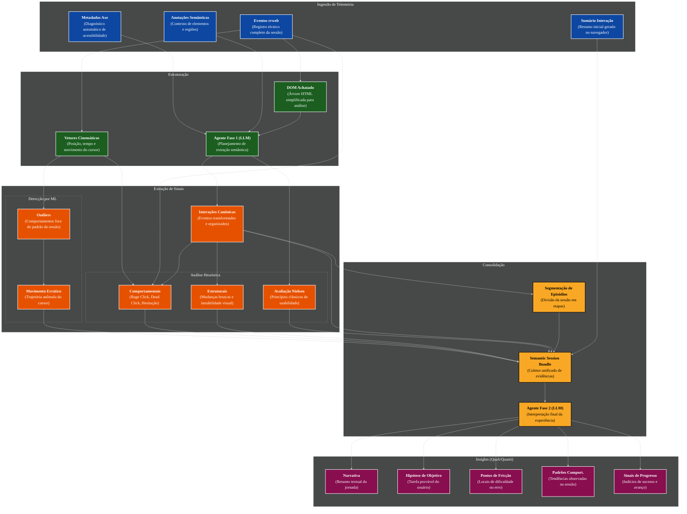

# Motor de Análise Multimodal

Este documento descreve a arquitetura do motor de análise da UX Auditor API, que integra Heurísticas Determinísticas, Machine Learning (Isolation Forest) e Agentes Baseados em LLM (Fases 1 e 2) para transformar rastros técnicos de interação em insights psicométricos e funcionais.

## Arquitetura de Processamento

O pipeline é dividido em etapas que elevam gradualmente o nível de abstração dos dados, desde eventos brutos até uma narrativa semântica consolidada.

### Diagrama de Fluxo

## Componentes Principais

### 1. Telemetria Enriquecida
Diferente de sistemas puramente baseados em vídeo ou logs brutos, a UX Auditor API utiliza um payload enriquecido proveniente de uma extensão de navegador. Este payload inclui:
- **Eventos rrweb:** Rastro técnico completo para reconstrução.
- **Metadados Axe:** Resultados de auditoria de acessibilidade automática em tempo de execução.
- **Anotações Semânticas:** Metadados inseridos pelo desenvolvedor ou inferidos pela extensão sobre a natureza dos componentes.

### 2. Fase 1: Planejamento Estrutural
Um agente LLM analisa o estado inicial da página (DOM achatado) e o contexto semântico para gerar um **Extraction Plan**. Este plano define quais áreas da tela são relevantes e qual a meta provável da página, além de realizar uma avaliação inicial das Heurísticas de Nielsen.

### 3. Execução e Análise de Sinais
As ações técnicas (clicks, inputs, mouse moves) são convertidas em **Interações Canônicas**. Sobre estas interações, operam dois motores:
- **Heurísticas:** Detectores determinísticos de padrões como *Rage Clicks*, *Hesitação* e *Revisão de Input*.
- **Machine Learning:** O algoritmo **Isolation Forest** analisa a cinemática do cursor (velocidade e variação angular) para identificar anomalias motoras (*Erratic Movement*).

### 4. Fase 2: Interpretação Semântica
O **Semantic Session Bundle** consolida todas as evidências (heurísticas, ML, interações canônicas e metadados da extensão). Um segundo agente LLM interpreta este bundle para gerar a análise final estruturada, focando em intenção do usuário, pontos de fricção e progresso.

## Saída de Dados
A análise estruturada resultante (`StructuredSessionAnalysis`) fornece:
- **Narrativa Qualitativa:** Um resumo em linguagem natural do que ocorreu na sessão.
- **Hipótese de Objetivo:** O que o usuário tentou realizar e qual o nível de confiança dessa inferência.
- **Pontos de Fricção:** Identificação clara de momentos de frustração ou confusão apoiados por evidências heurísticas.
- **Sinais de Progresso:** Indicadores de que o usuário está avançando em direção ao sucesso funcional.
