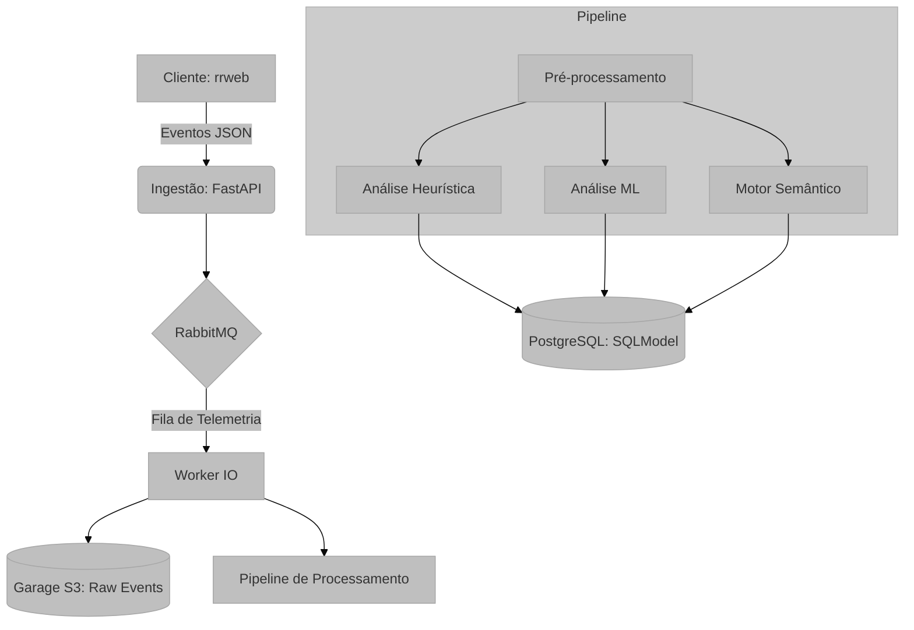

# Visão Geral do Sistema: UX Auditor API

## Visão Geral e Propósito
A **UX Auditor API** é uma plataforma de backend especializada na análise quantitativa e qualitativa da experiência do usuário (UX). O sistema processa fluxos de eventos de telemetria capturados via `rrweb`, transformando logs técnicos brutos em *insights* acionáveis.

O propósito central é automatizar a auditoria de interfaces, identificando:
1.  **Frustrações Técnicas:** Como cliques repetitivos em elementos não responsivos (*Rage Clicks*).
2.  **Anomalias Comportamentais:** Movimentos de mouse erráticos detectados via Inteligência Artificial.
3.  **Narrativas Semânticas:** Tradução de eventos técnicos para linguagem natural para compreensão rápida por gestores.
4.  **Estados Psicométricos:** Inferência de carga cognitiva e nível de frustração do usuário.

## Arquitetura e Lógica

O sistema segue uma arquitetura orientada a serviços e processamento assíncrono:

1.  **Ingestão:** Recebe eventos `rrweb` via REST API, autenticada via OAuth2 (Janus IDP).
2.  **Mensageria e Storage:** Os eventos são enfileirados no **RabbitMQ** e persistidos no **Garage (S3)** para processamento posterior.
3.  **Pipeline de Processamento (Worker):**
    *   **Pré-processamento O(N):** Uma única passagem pelos dados separa vetores cinemáticos de ações semânticas.
    *   **Análise de Baixo Nível:** Execução de algoritmos de ML (*Isolation Forest*) e heurísticas determinísticas.
    *   **Análise de Alto Nível:** Orquestração de LLMs para análise semântica e psicométrica.
4.  **Persistência:** Resultados consolidados em banco de dados **PostgreSQL** via **SQLModel**.

## Fundamentação Matemática
O sistema combina geometria computacional para análise cinemática e espaços vetoriais (embeddings) para análise de jornada.

*   **Cinemática de Mouse:** Representada por vetores $V = \{t, x, y\}$.
*   **Análise Semântica:** Uso de similaridade de cosseno em espaços latentes para detectar estagnação de jornada:
    $$ 	ext{similarity} = \frac{\mathbf{A} \cdot \mathbf{B}}{\|\mathbf{A}\| \|\mathbf{B}\|} $$

## Mapeamento Tecnológico e Referências
*   **Framework:** FastAPI. [Documentação](https://fastapi.tiangolo.com/)
*   **Processamento Numérico:** NumPy e Scikit-Learn.
*   **Captura de Sessão:** RRWeb. [Referência](https://github.com/rrweb-io/rrweb)
*   **Identidade:** Janus IDP (OIDC/OAuth2).

## Justificativa de Escolha
A escolha de uma arquitetura híbrida (Heurística + ML + LLM) justifica-se pela natureza multifacetada da UX: heurísticas capturam erros óbvios com baixo custo, ML detecta padrões sutis de anomalia, e LLMs fornecem o contexto qualitativo necessário para a tomada de decisão humana.
