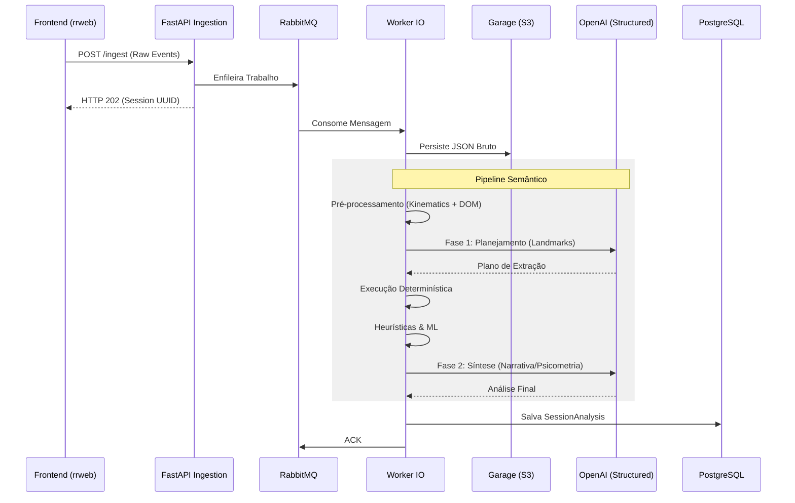

# Arquitetura e Pipeline de Processamento

Este documento detalha o funcionamento interno da **UX Auditor API**, descrevendo como os dados fluem desde a captura até a geração de insights semânticos.

## 1. Visão Geral da Arquitetura

O sistema utiliza uma abordagem de **Pipeline em Camadas**, onde cada etapa refina a abstração dos dados, transformando ruído técnico em sinal de UX.

### Fluxo de Componentes (Mermaid)

## 2. O Pipeline Semântico

A inovação central do projeto é o **Semantic Session Bundle**, um artefato que consolida toda a inteligência da sessão.

### 2.1 Pré-processamento O(N)
Uma única passagem pelos eventos `rrweb` realiza:
- **Cálculo Cinemático:** Transforma coordenadas (x, y, t) em vetores de velocidade e torque.
- **Achatamento de DOM:** Reconstrói o estado dos elementos interagidos sem carregar todo o Snapshot do rrweb.
- **Normalização:** Padroniza timestamps e tipos de eventos.

### 2.2 Fase 1: Planejamento Estrutural
O agente LLM recebe um resumo da estrutura da página e o rastro técnico. Sua responsabilidade é:
- Identificar **Landmarks** (ex: "Botão de Checkout", "Menu de Navegação").
- Definir **Objetivos Prováveis** do usuário.
- Mapear seletores CSS técnicos para nomes semânticos legíveis.

### 2.3 Execução e Heurísticas
Com o plano da Fase 1, o sistema executa algoritmos determinísticos para detectar:
- **Rage Clicks:** Cliques rápidos e repetitivos na mesma região.
- **Dead Clicks:** Cliques em elementos que não geram resposta no DOM.
- **Anomalias de Movimento:** Detecção de hesitação motora via *Isolation Forest* (ML).

### 2.4 Fase 2: Síntese Analítica
O agente final recebe o **Semantic Bundle** (compactado e enriquecido). Ele não precisa processar milhares de eventos técnicos, apenas dezenas de **Interações Canônicas**.
**Outputs gerados:**
- **Narrativa da Sessão:** Resumo textual do que o usuário tentou fazer.
- **Hipóteses de Intenção:** O que o usuário queria alcançar.
- **Pontos de Fricção:** Onde e por que o usuário falhou.
- **Confiança:** Nível de certeza da análise baseada nas evidências.

## 3. Persistência e Recuperação

- **Dados Brutos (S3):** Mantidos para reprocessamento (replay) ou treinamento de novos modelos de ML.
- **Dados Estruturados (SQL):** Armazenados via `SQLModel` para consultas rápidas via API e dashboards.

## 4. Tratamento de Erros e Resiliência

- **Dead Letter Queues:** Mensagens que falham 5 vezes são movidas para uma fila de erro.
- **Idempotência:** O sistema garante que a mesma sessão possa ser reprocessada sem duplicar registros no banco de dados.
- **Circuit Breaker:** Proteção contra falhas na API da OpenAI ou instabilidades no Banco de Dados.
