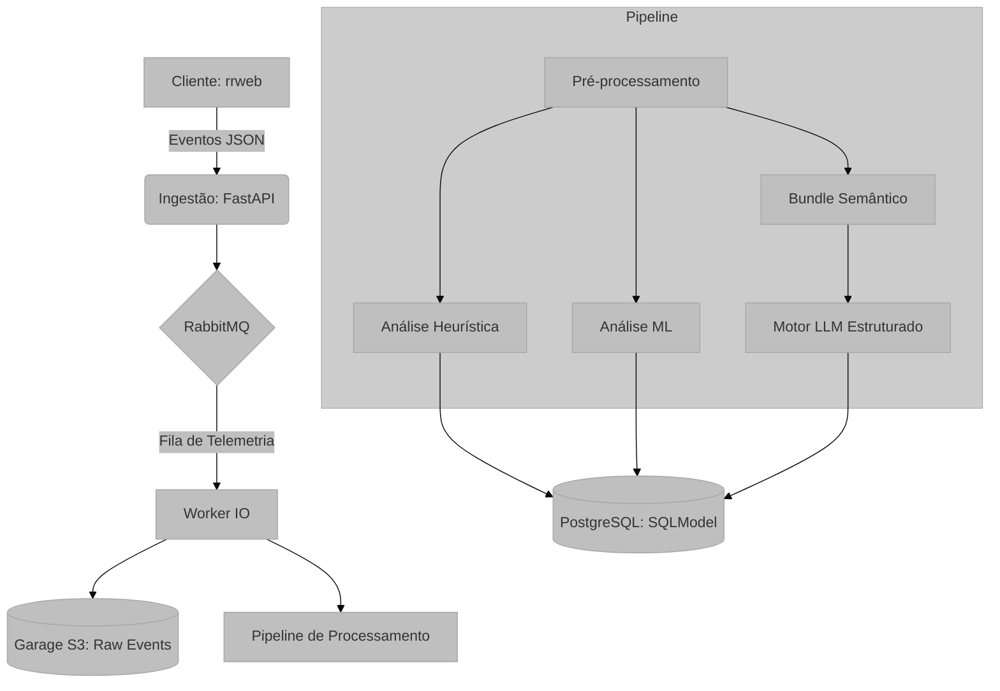

# Visão Geral do Sistema: UX Auditor API

## Visão Geral e Propósito
A **UX Auditor API** é uma plataforma de backend especializada na análise quantitativa e qualitativa da experiência do usuário (UX). O sistema processa fluxos de eventos de telemetria capturados via `rrweb`, transformando logs técnicos brutos em *insights* acionáveis.

O propósito central é automatizar a auditoria de interfaces, identificando:
1.  **Frustrações Técnicas:** Como cliques repetitivos em elementos não responsivos (*Rage Clicks*).
2.  **Anomalias Comportamentais:** Movimentos de mouse erráticos detectados via Inteligência Artificial.
3.  **Interpretação Estruturada:** Síntese analítica via LLM a partir de um bundle semântico intermediário.
4.  **Hipóteses Comportamentais:** Inferências controladas com evidência explícita, confiança e ambiguidades.

## Arquitetura e Lógica

O sistema segue uma arquitetura orientada a serviços e processamento assíncrono:

1.  **Ingestão:** Recebe eventos `rrweb` via REST API, autenticada via OAuth2 (Janus IDP).
2.  **Mensageria e Storage:** Os eventos são enfileirados no **RabbitMQ** e persistidos no **Garage (S3)** para processamento posterior.
3.  **Pipeline de Processamento (Worker):**
    *   **Pré-processamento O(N):** Uma única passagem pelos dados separa vetores cinemáticos de ações semânticas.
    *   **Análise de Baixo Nível:** Execução de algoritmos de ML (*Isolation Forest*) e heurísticas determinísticas.
    *   **Análise de Alto Nível:** LLM interpreta apenas o bundle semântico intermediário e produz análise estruturada.
4.  **Persistência:** Resultados consolidados em banco de dados **PostgreSQL** via **SQLModel**.

## Contrato do Frontend

O frontend não espera a request terminar o processamento pesado. O fluxo correto é:

1. chamar `POST /ingest`
2. guardar o `session_uuid` retornado
3. consultar `GET /sessions/{session_uuid}/status` em polling
4. tratar `status == completed` como pronto
5. tratar `status == failed` como erro de processamento

Enquanto `status` estiver em `queued` ou `processing`, a sessão ainda não terminou.

## Fundamentação Matemática
O sistema combina geometria computacional para análise cinemática, heurísticas determinísticas e um estágio de interpretação semântica controlada.

*   **Cinemática de Mouse:** Representada por vetores $V = \{t, x, y\}$.
*   **Análise Semântica:** O LLM opera sobre evidências compactadas e não sobre o rrweb bruto.

## Mapeamento Tecnológico e Referências
*   **Framework:** FastAPI. [Documentação](https://fastapi.tiangolo.com/)
*   **Processamento Numérico:** NumPy e Scikit-Learn.
*   **Captura de Sessão:** RRWeb. [Referência](https://github.com/rrweb-io/rrweb)
*   **Identidade:** Janus IDP (OIDC/OAuth2).

## Justificativa de Escolha
A escolha de uma arquitetura híbrida (Heurística + ML + LLM) justifica-se pela natureza multifacetada da UX: heurísticas capturam erros óbvios com baixo custo, ML detecta padrões sutis de anomalia, e o LLM interpreta evidências estruturadas sem reprocessar eventos brutos.
