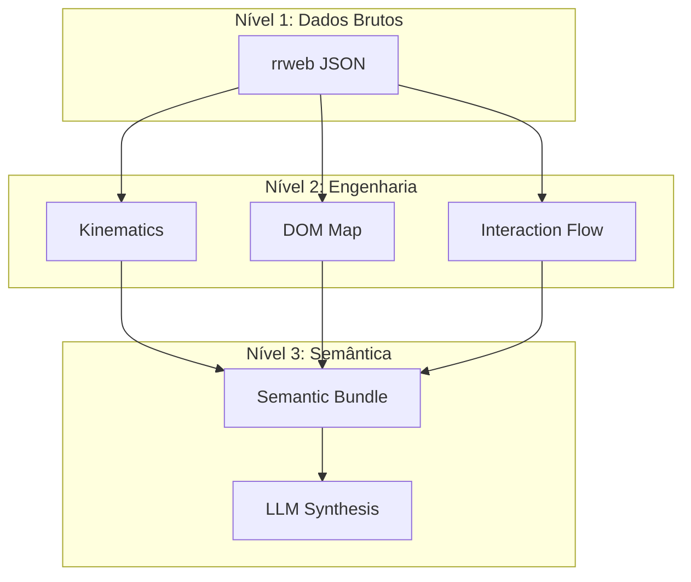

# Detalhes do Pipeline: Do rrweb ao Insight Semântico

Este documento detalha as transformações técnicas que os dados sofrem ao passar pelo pipeline de análise.

## 1. Transformação de Dados O(N)

O pipeline começa com o **SessionPreprocessor**, que realiza uma passagem linear por todos os eventos `rrweb`.

### 1.1 Vetores Cinemáticos
O sistema filtra todos os eventos de movimento do mouse (`type: 3, source: 1`) e os transforma em vetores normalizados:
- **Timestamp:** Relativo ao início da sessão (ms).
- **Coordenadas:** Posição $(x, y)$ na janela.
- **Deltas:** Velocidade escalar e variação angular (torque) para detecção de anomalias.

### 1.2 Ações DOM e Contexto
Eventos de interação (cliques, inputs, scroll) são enriquecidos com informações do estado do elemento no momento da ação.
- **Target Mapping:** O ID do nó (`nodeId`) é resolvido para uma estrutura simplificada que contém `tagName`, `id`, `attributes` e `textContent`.
- **Deduplicação:** Eventos redundantes de scroll ou resize são compactados para economizar processamento posterior.

## 2. A Camada Semântica

A inovação do projeto reside no desacoplamento entre a **Captura Técnica** e a **Interpretação Humana**.

### 2.1 Achatamento de DOM Semântico
Para o LLM, o HTML bruto é muito ruidoso. O sistema gera uma representação "achatada" que foca no que é relevante para UX:
- **Atributos Limpos:** Mantemos apenas `aria-label`, `title`, `alt` e `name`.
- **Truncamento Inteligente:** Conteúdos de texto longos são resumidos para manter o contexto sem estourar o limite de tokens.

### 2.2 Fase 1: O "Planner"
O agente de Planejamento Estrutural utiliza o rastro consolidado para gerar o **Phase 1 Extraction Plan**. Este plano define:
- **Landmarks Principais:** Identifica as âncoras da página (ex: "Barra de busca", "Grade de produtos").
- **Mapeamento de Objetivos:** Relaciona as ações do usuário com objetivos prováveis (ex: "O usuário está tentando filtrar os resultados").

### 2.3 Fase 2: O "Auditor"
A Fase 2 recebe o **Semantic Session Bundle**, que já contém:
1.  **Interações Canônicas:** Ações já traduzidas para linguagem humana (ex: "Usuário clicou em 'Finalizar Compra'").
2.  **Alertas de Heurísticas:** Diagnósticos como Rage Click já calculados.
3.  **Insights de ML:** Pontos onde o movimento foi considerado errático.

## 3. Desempenho e Escalabilidade

Ao realizar o pré-processamento pesado em Python puro (NumPy) antes de enviar para o LLM, conseguimos:
- **Redução de Custo:** Sessões de 10 minutos (milhares de eventos) são compactadas em bundles de 2KB a 5KB.
- **Menor Latência:** O LLM processa menos tokens e retorna respostas muito mais precisas, pois o contexto já está "pré-digerido".
- **Reprodutibilidade:** O bundle semântico pode ser armazenado e re-analisado por diferentes modelos de LLM sem precisar repetir o pré-processamento pesado.
