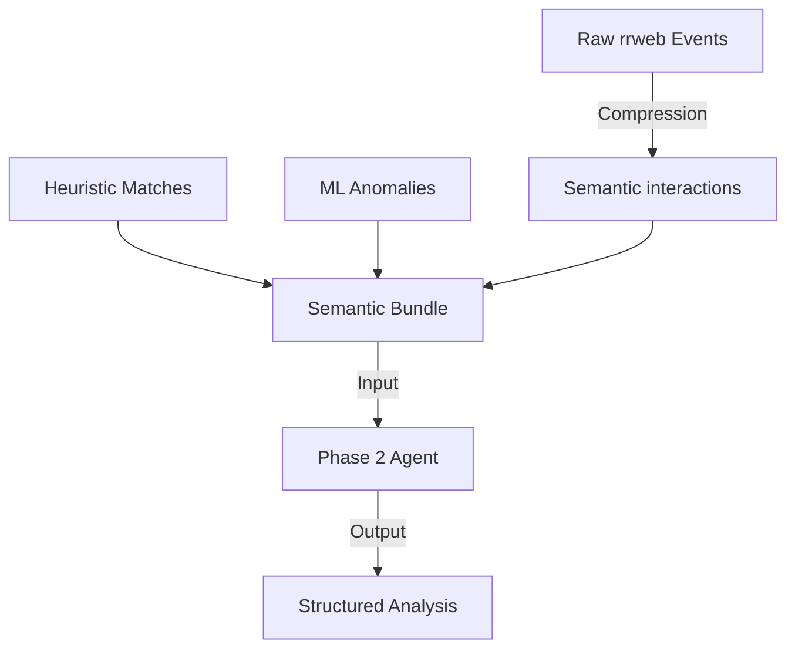

# Engine Semântica e Interpretação (LLM)

A camada de inteligência da UX Auditor API baseia-se em uma arquitetura de Agentes LLM especializados, utilizando saídas estruturadas (JSON Schema) para garantir integração determinística com o restante do sistema.

## 1. Arquitetura de Duas Fases

O processamento é dividido para otimizar o uso de tokens e aumentar a precisão da análise, evitando que o modelo se perca em detalhes técnicos irrelevantes.

### Fase 1: Planejamento Estrutural (The Planner)
O primeiro agente atua como um "analista de interface". Ele recebe o contexto da página (URL, título, landmarks principais) e um resumo técnico dos eventos.

**Responsabilidades:**
- **Mapeamento de Landmarks:** Identifica regiões funcionais (Header, Footer, Main Content, Modals).
- **Tradução Semântica:** Mapeia seletores CSS (ex: `#btn-32`) para nomes humanos (ex: "Botão Confirmar Cadastro").
- **Geração de Plano:** Define quais elementos devem ser monitorados para entender o objetivo do usuário.

### Fase 2: Síntese e Psicometria (The Auditor)
O segundo agente recebe o **Semantic Bundle** — um documento rico que contém as interações canônicas, heurísticas detectadas e anomalias de ML.

**Responsabilidades:**
- **Narrativa da Sessão:** Constrói um resumo executivo em linguagem natural.
- **Hipóteses de Intenção:** Infere o que o usuário tentou realizar e onde parou.
- **Pontos de Fricção:** Explica o *porquê* das frustrações detectadas (ex: "O usuário tentou clicar no logo esperando voltar para a home, mas o elemento não tinha link").
- **Métricas Psicométricas:** Atribui scores de Confiança e Ambiguidade à análise.

## 2. Structured Outputs e Confiabilidade

Utilizamos o recurso de **Structured Outputs** (JSON Schema) da OpenAI para garantir que a resposta do LLM siga rigorosamente os modelos Pydantic definidos em `services/semantic_analysis/phase1/models.py` e `phase2/models.py`.

### Vantagens:
- **Zero Parsing Errors:** Elimina falhas de regex ou JSON mal-formado.
- **Validação de Tipos:** Garante que enums, listas e campos obrigatórios estejam presentes.
- **Integração Fluida:** Os dados retornados são instanciados diretamente em objetos do sistema.

## 3. O "Semantic Bundle"

O Bundle é o contrato de interface entre o mundo determinístico (Heurísticas/ML) e o mundo probabilístico (LLM). Ele compacta uma sessão de 5000 eventos `rrweb` em um resumo de ~20 interações semânticas, permitindo análises complexas em modelos com janelas de contexto menores e menor custo.

## 4. Prompt Engineering

Os prompts são versionados e armazenados em `services/semantic_analysis/phase1/prompt.py` e `phase2/prompt.py`. Eles utilizam técnicas de:
- **Few-shot Prompting:** Exemplos de mapeamento semântico.
- **Chain of Thought:** Instruções para o modelo raciocinar sobre as evidências antes de concluir a intenção.
- **Role Play:** O modelo é instruído a atuar como um "Senior UX Researcher".
