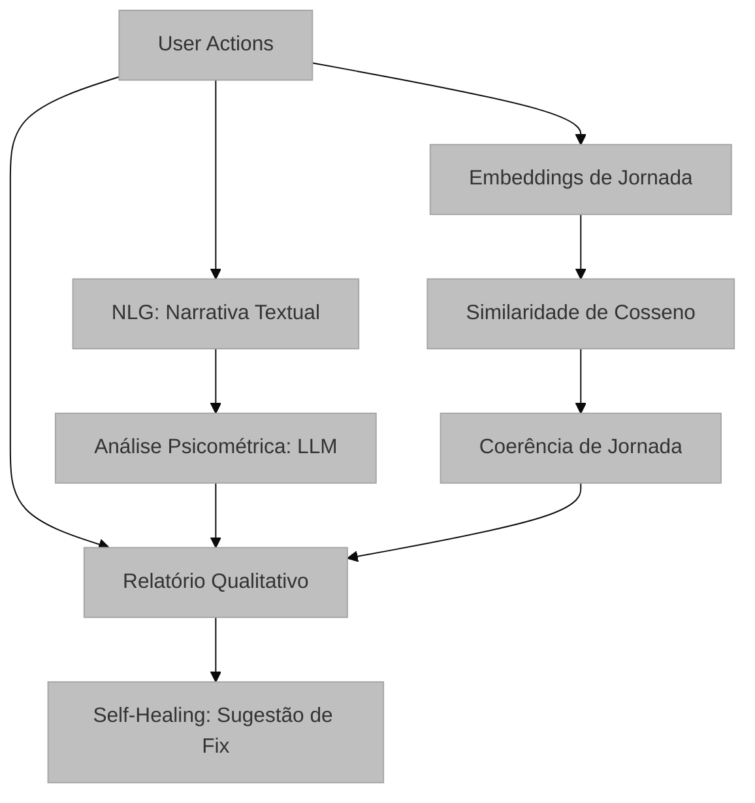

# Motor Semântico: NLG e Inferência via LLM

## Visão Geral e Propósito
O `semantic_engine.py` (em `semantic/semantic_engine.py`) representa a camada de inteligência de alto nível do sistema. Ele converte dados quantitativos em narrativas qualitativas e realiza inferências psicológicas sobre o estado do usuário, utilizando Modelos de Linguagem de Grande Escala (LLMs).

## Arquitetura e Lógica

O motor opera em quatro fases distintas:

1.  **Geração de Narrativa (NLG):** Transforma a lista de `UserActions` em um parágrafo textual coerente, destacando hesitações (inatividade > 3s) e fluxos de navegação.
2.  **Análise Psicométrica:** Submete a narrativa a um LLM instruído para pontuar Frustração e Carga Cognitiva.
3.  **Análise de Coerência de Jornada:**
    *   **Quantitativo:** Usa Embeddings para calcular a similaridade de cosseno entre URLs visitadas, detectando loops ou estagnação semântica.
    *   **Qualitativo:** LLM interpreta a intenção do usuário.
4.  **Self-Healing (Reparo de Código):** Se um Rage Click é detectado, o sistema analisa o HTML do elemento alvo e sugere correções (ex: melhorias de acessibilidade WAI-ARIA).

## Fundamentação Matemática
*   **Detecção de Hesitação:**
    $$ 	ext{Hesitation} = 	ext{True if } (t_{i} - t_{i-1}) > 3000	ext{ms} $$
*   **Similaridade de Cosseno (Embeddings):**
    Utilizada para medir a proximidade semântica entre estados da aplicação.
    $$ S_c(\mathbf{A}, \mathbf{B}) = \frac{\sum_{i=1}^n A_i B_i}{\sqrt{\sum_{i=1}^n A_i^2} \sqrt{\sum_{i=1}^n B_i^2}} $$

## Parâmetros Técnicos
*   `LLM_MODEL`: NousResearch/Hermes-4-405B (Foco em raciocínio complexo).
*   `EMBEDDING_MODEL`: Qwen/Qwen3-Embedding-8B (Foco em representação semântica).
*   `temperature=0.3` (Psicométricas): Balanceia criatividade e precisão.
*   `temperature=0.1` (Jornada): Foco em análise factual e rigorosa.

## Mapeamento Tecnológico e Referências
*   **NLG (Natural Language Generation):** Técnica de converter dados estruturados em texto.
*   **WAI-ARIA:** Padrão para acessibilidade web (usado no Self-Healing). [W3C Reference](https://www.w3.org/WAI/standards-guidelines/aria/)
*   **Embeddings de Texto:** Baseados em arquiteturas Transformer (BERT/GPT).

## Justificativa de Escolha
O uso de LLMs de alta escala (405B parâmetros) justifica-se pela necessidade de compreender nuances subjetivas do comportamento humano que algoritmos tradicionais não conseguem capturar. A integração com Embeddings permite uma validação matemática da narrativa gerada, garantindo que a análise qualitativa tenha fundamentação quantitativa.
