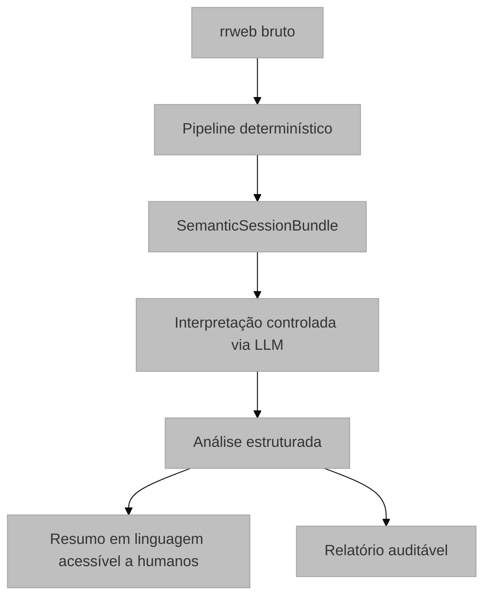

# Motor Semântico: Interpretação Estruturada via LLM

## Visão Geral e Propósito
O `semantic_engine.py` (em `semantic/semantic_engine.py`) representa a camada de interpretação de alto nível do sistema. Ele não reprocessa o rrweb bruto; consome apenas o `SemanticSessionBundle` já otimizado e produz uma análise estruturada, auditável e orientada a evidências.

## Arquitetura e Lógica

O motor opera em duas fases distintas:

1.  **Preparação do pacote de evidências:** o pipeline determinístico gera fatos observáveis, sinais derivados, heurísticas, segmentos de tarefa e trace compactada.
2.  **Interpretação via LLM:** o modelo lê apenas o bundle intermediário e produz:
    * `session_narrative`
    * `goal_hypothesis`
    * `behavioral_patterns`
    * `friction_points`
    * `progress_signals`
    * `ambiguities`
    * `hypotheses`
    * `evidence_used`
    * `overall_confidence`

## Contrato Epistemológico
O LLM deve:
* tratar fatos observados como evidência primária
* distinguir observação de inferência
* atribuir confiança às hipóteses
* explicitar ambiguidades
* evitar conclusões categóricas quando a base é fraca

O LLM não deve:
* inventar eventos ausentes
* afirmar intenção, frustração ou carga cognitiva como fato
* reprocessar o rrweb bruto
* narrar cada clique ou evento técnico em sequência literal

## Saída Estruturada
A função `generate_structured_session_analysis(...)` retorna um envelope com:
* `status`
* `structured_analysis`
* `human_readable_summary`
* `structured_fallback`
* `error`

A função `generate_human_readable_narrative(...)` deriva a narrativa textual da análise estruturada, sem inverter essa dependência.

## Parâmetros Técnicos
* `LLM_MODEL`: NousResearch/Hermes-4-405B (Foco em raciocínio complexo).
* `temperature=0.2` Para reduzir variação e extrapolação
* `top_p=1.0`
* Retorno em JSON estrito

## Mapeamento Tecnológico e Referências
*   **NLG (Natural Language Generation):** Técnica de converter dados estruturados em texto.
*   **WAI-ARIA:** Padrão para acessibilidade web (usado no Self-Healing). [W3C Reference](https://www.w3.org/WAI/standards-guidelines/aria/)
*   **Embeddings de Texto:** Baseados em arquiteturas Transformer (BERT/GPT).

## Justificativa de Escolha
O uso de LLMs de alta escala (405B parâmetros) justifica-se pela necessidade de compreender nuances subjetivas do comportamento humano que algoritmos tradicionais não conseguem capturar.